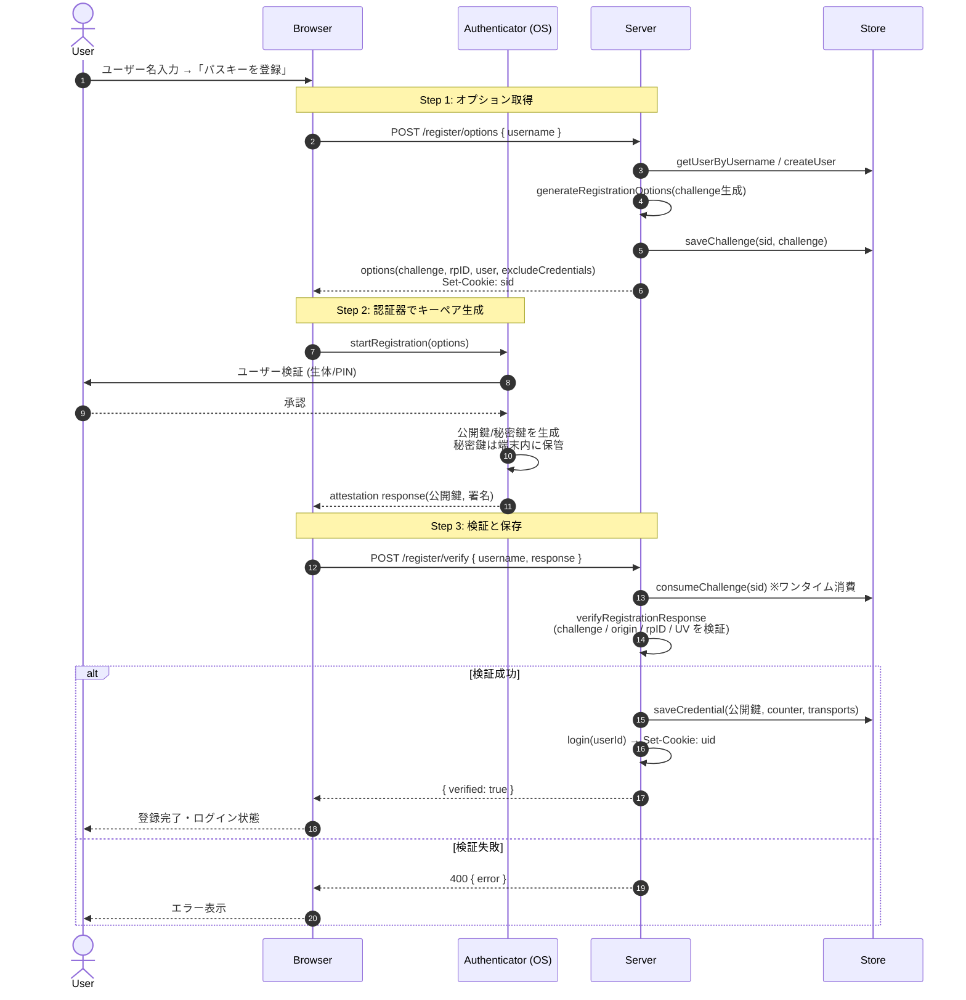
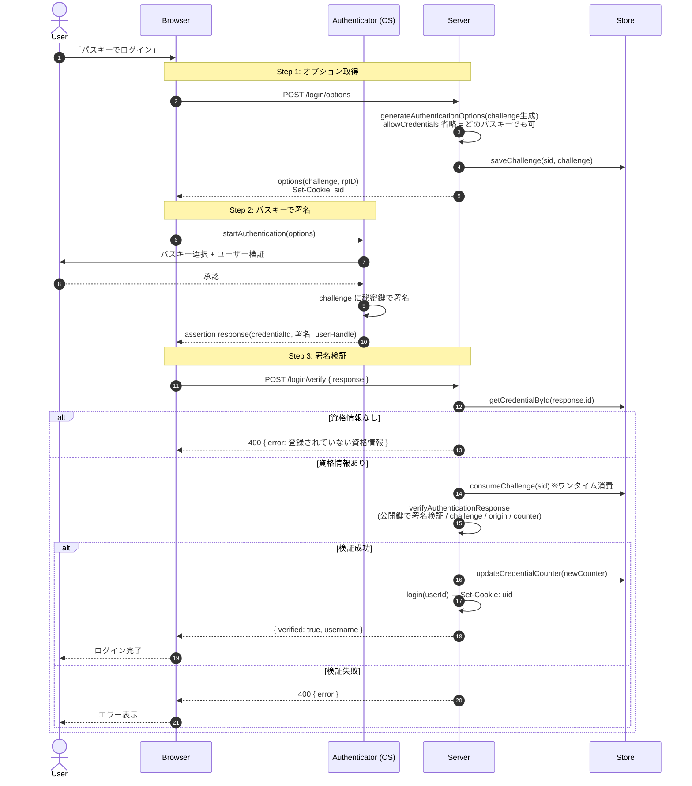
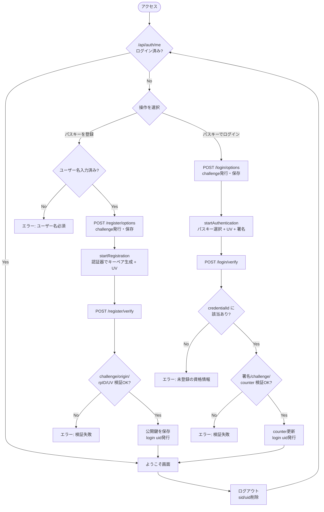
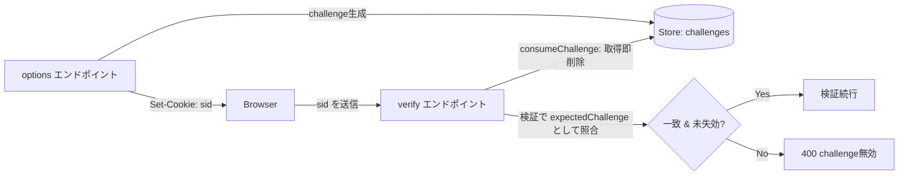

# Passkey 認証フロー図

実装（`src/app/api/auth/**`, `src/app/page.tsx`, `src/lib/**`）に対応したフロー図。

## 登場要素

| 要素 | 対応コード |
| --- | --- |
| User | エンドユーザー |
| Browser | `src/app/page.tsx`（React）+ `@simplewebauthn/browser` |
| Authenticator | OS/ブラウザのパスキー機構（Touch ID 等） |
| Server | `src/app/api/auth/**/route.ts` |
| Store | `src/lib/store.ts`（運用時は DynamoDB 等） |

---

## 1. 登録（パスキー作成）— シーケンス図

---

## 2. ログイン（認証）— シーケンス図

ユーザー名レス（Discoverable Credential）方式。

---

## 3. 全体フローチャート（登録／ログインの分岐）

---

## challenge と Cookie の流れ（補足）

- `challenge` は **ワンタイム**（`consumeChallenge` で取得と同時に削除）+ **5分TTL** → リプレイ攻撃対策
- `sid` Cookie は **httpOnly / secure(本番) / sameSite=lax**
